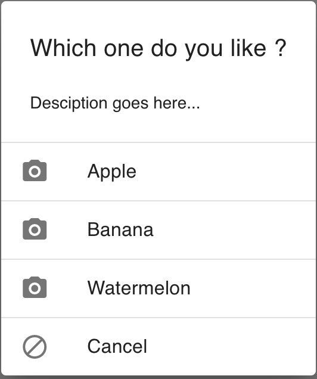
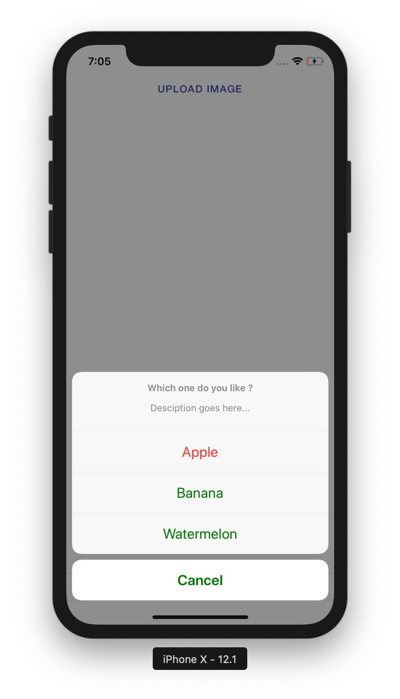
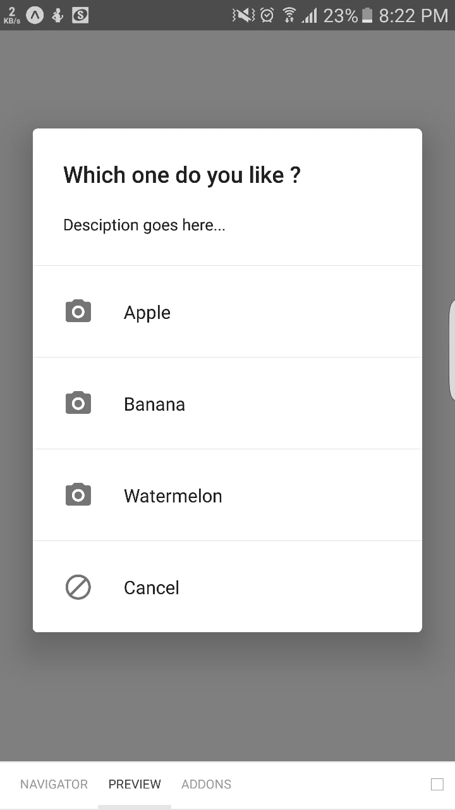

# ActionSheet

ActionSheet provides bottom up sheet for iOS and a dialog box sheet on Android and Desktop.

## Usage

```jsx
<React.Fragment>
    <Button
        title="Upload Image"
        onPress={() => {
            this.pickerVisible.show();
        }}
    />

    <ActionSheet
        title="Which one do you like ?"
        ref={(ref: any) => (this.pickerVisible = ref)}
        options={options}
        onPress={(_index: any) => {
            /** Code logic */
        }}
        cancelButtonIndex={0}
        destructiveButtonIndex={1}
        message="Description goes here..."
        tintColor={'green'}
    />
</React.Fragment>
```

## Screenshots

|                             Web                             |                             IOS                             |                             Android                             |
| :---------------------------------------------------------: | :---------------------------------------------------------: | :-------------------------------------------------------------: |
|  |  |  |

## Component Props

|          Name          |       Type       | Default |                                Description                               |
| :--------------------: | :--------------: | :-----: | :----------------------------------------------------------------------: |
|          title         | ActionSheetProps |         |                         Display dialog box Title                         |
|           ref          | ActionSheetProps |         | this component can be Pass from parent component to child as a reference |
|         options        | ActionSheetProps |         |            List of array to be passed to print the list items            |
|    cancelButtonIndex   | ActionSheetProps |         |     Array index to be passed to mark the cancel button action onPress    |
| destructiveButtonIndex | ActionSheetProps |         |       Array index  to mark destructive button under provided array       |
|         message        | ActionSheetProps |         |             It is the description of Action sheet under title            |
|        tintColor       | ActionSheetProps |         |                Allow us to change the color of the array.                |

## Component Style

|  Name  |    Type   |            Description           |
| :----: | :-------: | :------------------------------: |
|  root  | ViewStyle | These styles are applied on root |
|  links | ViewStyle |    These styles are for links    |
| madeIn | ViewStyle |    These styles are for madeIn   |

## User Stories

|                               Story                               | In Storybook | Has Unit Test |
| :---------------------------------------------------------------: | :----------: | :-----------: |
|     It should show dialog on Android and desktop as Dialog Box    |       ✅      |       ✅       |
|           It should show dialog on IOS as a ActionSheet           |       ✅      |       ✅       |
|       It should render List of options on IOS using an Array      |       ✅      |       ✅       |
| It should show ActionSheet on IOS using jest toHaveBeenCalledWith |       ❌      |       ✅       |
|                   It should show title on render                  |       ✅      |       ✅       |
|           It should return nothing if the title is Null           |       ✅      |       ✅       |
|           It should show React.Element under title props          |       ✅      |       ✅       |
|        It should show cancel Button using cancelButtonIndex       |       ✅      |       ✅       |

## Questions and Assumptions

| Questions and Assumptions | Answers |
| :-----------------------: | :-----: |
|                           |         |
