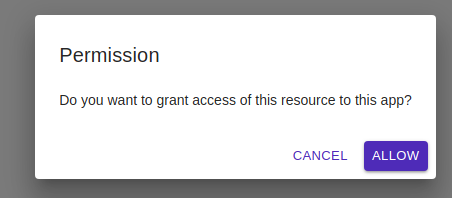
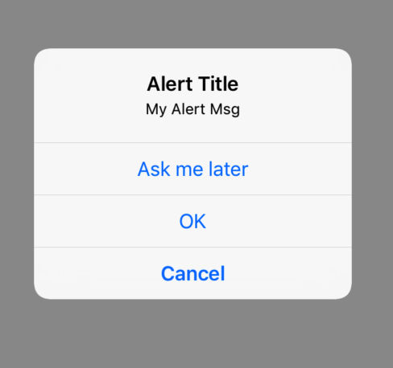

# Alert

A Dialog which shows the alert message .

## Usage

```jsx
<Alert 
    title="Alert Title"
    message="Alert message goes here ..."
    buttons={[
		{ text: 'Ask me later', onPress: () => console.log('Ask me later pressed') },
		{
			text: 'Cancel',
			onPress: () => console.log('Cancel Pressed'),
		},
		{ text: 'OK', onPress: () => console.log('OK Pressed') },
	]}
    cancelable={ cancelable: true }
/>
```

## ScreenShots

|                  🌏 Web                  |                      📱 Android                      |                          📱 iOS                          |
| :--------------------------------------: | :--------------------------------------------------: | :------------------------------------------------------: |
|  |  |  |

## Component Props

|    Name    |  Type  |              Default             |        Description        |
| :--------: | :----: | :------------------------------: | :-----------------------: |
|    title   | string |            Alert Title           |                           |
|   message  | string |         Alert Description        |                           |
|   buttons  |  Array |                                  | Alert dialog buttons list |
| cancelable | object | cancelable: { cancelable: true } |    defalut Alert action   |

## User Stories

|                  Story                 | In Storybook | Has Unit Test |
| :------------------------------------: | :----------: | :-----------: |
|      should show dialog on render      |       ✅      |       ✅       |
|     should close dialog on Dismiss     |       ❌      |       ✅       |
| should show dialog on render in native |       ❌      |       ✅       |
