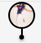

# LocationAskPermissionView

Shows a view which has a marker with an image, it will be used to mark the location on the map .

## Usage

```jsx
 <AvatarMarker type="image" image={{ uri: '' }} />
```

## ScreenShots

|                 🌏 Web                 |                         📱 Android                        |                         📱 iOS                        |
| :------------------------------------: | :-------------------------------------------------------: | :---------------------------------------------------: |
|  |  |  |

## Component Props

|  Name  |        Type        | Default |                  Description                  |
| :----: | :----------------: | :-----: | :-------------------------------------------: |
| styles | AvatarMarkerStyles |         | styles which will be applied on the component |

## Component Styles

|       Name      |    Type   | Default |                      Description                      |
| :-------------: | :-------: | :-----: | :---------------------------------------------------: |
|       root      | ViewStyle |    ️    |        the styles will be applied on root level       |
| avatarContainer | ViewStyle |         | styles which will be applied on Avatar container View |
|      stick      | ViewStyle |    ️    |          the styles will be applied on stick          |
|       dot       | ViewStyle |         |          styles which will be applied on dot          |

## User Stories

|                                 Story                                | In Storybook | Has Unit Test |
| :------------------------------------------------------------------: | :----------: | :-----------: |
|               should show a Avatar Marker with an image              |       ✅      |       ✅       |
| should not throw exceptions even when used directly without BlueBase |       ✅      |       ✅       |
