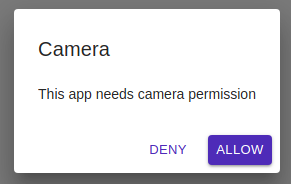
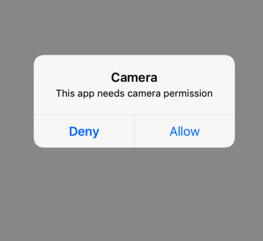

# CameraPermission

CameraPermission is the screen for Camera Permission

## Usage

```jsx
<CameraPermission>
	<ComponentWhenPermissionIsThere />
</CameraPermission>
```

## Screenshots

|                               Web                              | Android |                               IOS                               |
| :------------------------------------------------------------: | :-----: | :-------------------------------------------------------------: |
|  |    ❌    |  |

## Component Props

extends PermissionProps

## User Stories

|                                                               Story                                                               | In Storybook | Has Unit Test |
| :-------------------------------------------------------------------------------------------------------------------------------: | :----------: | :-----------: |
|                       User should be able to see ask permission view in case the permission is not available                      |       ✅      |       ✅       |
|                                     On clicking Grant button should show a confirmation dialog                                    |       ✅      |       ✅       |
| There should be an allow button there. On clicking allow button we should prompt user to give us the permission ask by the system |       ✅      |       ✅       |
|                                                                                                                                   |              |               |
