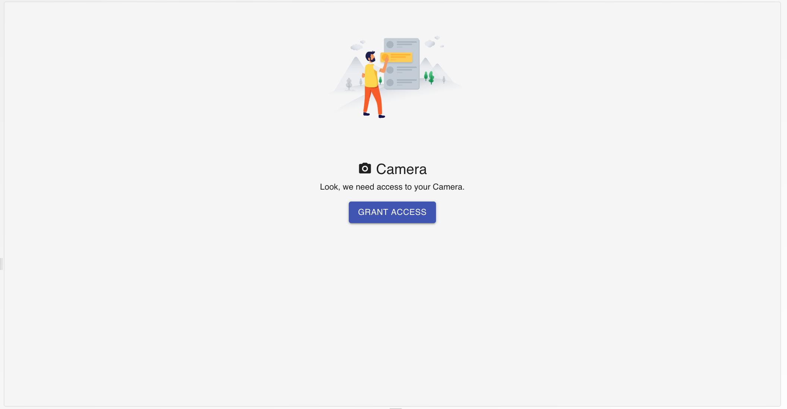
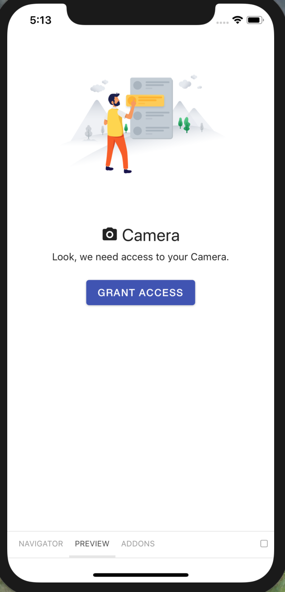
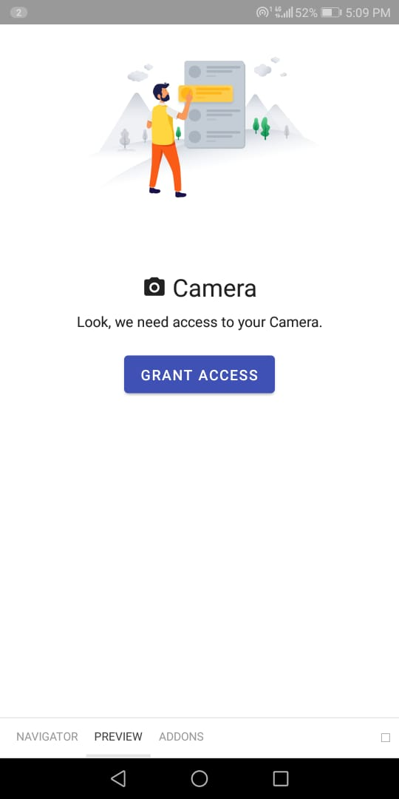

# CameraPermissionAskView

Renders the grant access view with a confirmation dialog. On Clicking the grant access button it will open the confirmation dialog then we will pitch for the actual permission.

## Usage

```jsx
<CameraPermissionAskView
requestPermissionFn = {()=>
    //request callback
}
/>
```

## Screenshots

|                     Web                     |                     IOS                     |                       Android                        |
| :-----------------------------------------: | :-----------------------------------------: | :--------------------------------------------------: |
|  |  |  |

## Component Props

|        Name         |      Type      | Default | Description |
| :-----------------: | :------------: | :-----: | :---------: |
| requestPermissionFn |    function    |         |             |
|       styles        | Partial styles |         |             |

## Sub Styles

|      Name      |         Type          | Default | Description |
| :------------: | :-------------------: | :-----: | :---------: |
|      root      |        object         |         |             |
| componentState | ComponentState styles |         |             |
|     image      |        object         |         |             |
|     button     |        object         |         |             |

## Supported Props

|        Prop         | Compatible |                   Comments                    |
| :-----------------: | :--------: | :-------------------------------------------: |
| requestPermissionFn |    ️✅     | Fully compatible with CameraPermissionAskView |
|       styles        |    ✅ ️    | Fully compatible with CameraPermissionAskView |

## Design States

- Normal State: Normal
- Empty State: No Componenet displayed
- Loading State: No Loading state

## User Stories

|                              Story                               | In Storybook | Has Unit Test |
| :--------------------------------------------------------------: | :----------: | :-----------: |
|        User should see CameraPermissionAskView with title        |      ✅      |      ✅       |
|              Title text should be center justified               |      ✅      |      ✅       |
| Description, Picture and Grant Button should be center justified |      ✅      |      ✅       |
|  On Pressing Grant Button, it should show a Conformation Dialog  |      ✅      |      ✅       |
|       The cases for Dialog are in the respective component       |      ✅      |      ✅       |

\|
