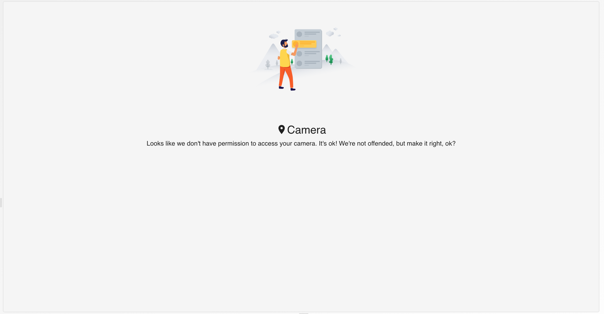
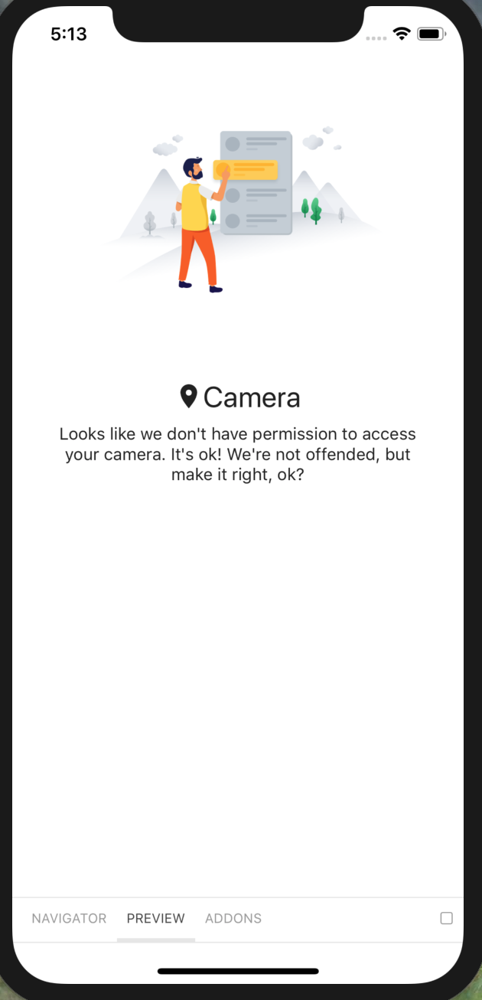
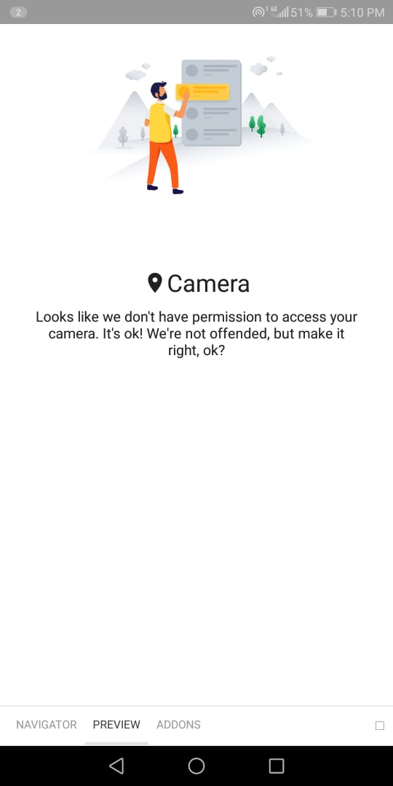

# CameraPermissionDeniedView

The View is rendered when the user denies to give Camera permission.

## Usage

```jsx
<CameraPermissionDeniedView
	styles={{
		root: {
			justifyContent: 'center',
			padding: 30,
		},
		componentState: {
			root: {
				marginBottom: 10,
				paddingHorizontal: 10,
			},
			title: {
				color: 'red',
			},
		},
		image: {
			height: 250,
			resizeMode: 'contain',
			width: 250,
		},
	}}
/>
```

## Screenshots

|                       Web                      |                       IOS                      |                         Android                         |
| :--------------------------------------------: | :--------------------------------------------: | :-----------------------------------------------------: |
|  |  |  |

## Component Props

|  Name  |      Type      | Default | Description |
| :----: | :------------: | :-----: | :---------: |
| styles | Partial Styles |         |             |

## Supported Props

|  Prop  | Compatible | Comments |
| :----: | :--------: | :------: |
| styles |     ️✅     |          |

## Sub Styles

|      Name      |          Type         | Default | Description |
| :------------: | :-------------------: | :-----: | :---------: |
|      root      |         object        |         |             |
| componentState | ComponentState styles |         |             |
|      image     |         object        |         |             |
|     button     |         object        |         |             |

\|

## Design States

-   Normal State: Normal
-   Empty State: No Componenet displayed
-   Loading State: null

## User Stories

|                         Story                         | In Storybook | Has Unit Test |
| :---------------------------------------------------: | :----------: | :-----------: |
| User should see CameraPermissionDeniedView with title |       ✅      |       ✅       |
|         Title text should be center justified         |       ✅      |       ✅       |
|       If title is empty then show an empty state      |       ✅      |       ✅       |
|   Description and Picture should be center justified  |       ✅      |       ✅       |
|     Should render the component wih default styles    |       ✅      |       ✅       |
|       Should apply custom styles passed in props      |       ✅      |       ✅       |

\|
