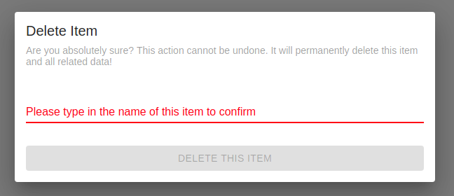
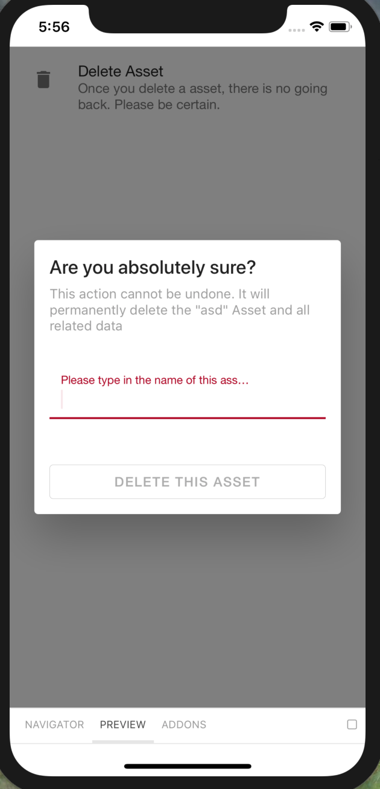
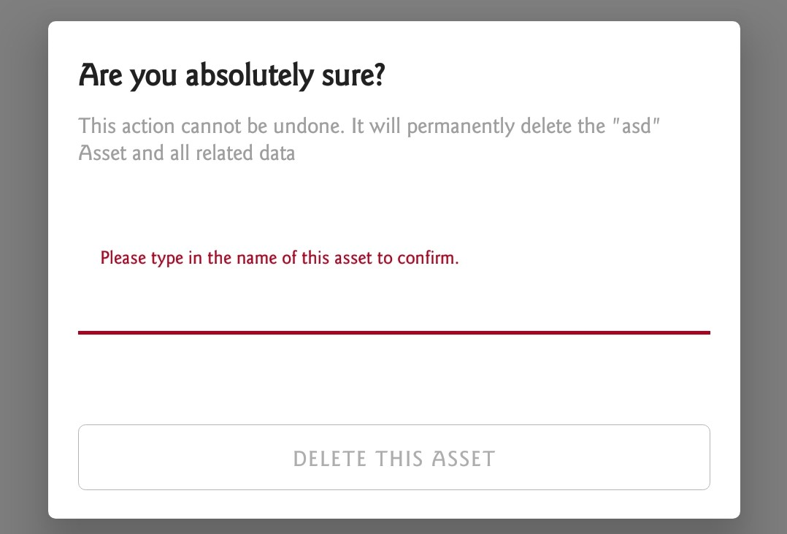

# DangerSettingAction

Displays a list option to perform a "dangerous" action in the app i.e. Delete Something. On press, displays a confirmation dialog and makes the user type a pass code.

## Usage

```jsx
<DangerSettingAction title="Place" code="123" onSuccess={(actions: FormikActions<{}>, closeDialog: () => void) => {}}>
```

## ScreenShots

|                   Web                  |                     IOS                    |                     Android                    |
| :------------------------------------: | :----------------------------------------: | :--------------------------------------------: |
|  |  |  |

## Component Props

|        Name        |                               Type                              |                                                      Default                                                      |                                          Description                                          |
| :----------------: | :-------------------------------------------------------------: | :---------------------------------------------------------------------------------------------------------------: | :-------------------------------------------------------------------------------------------: |
|        title       |                              string                             |                                                  Delete this item                                                 |                                        List Item Title                                        |
|     description    |                              string                             |                       Once you delete this item, there is no going back. Please be certain.                       |                                     List Item Description                                     |
|      iconProps     |                          ListIconProps                          |                                                                             |                                      List Item Icon props                                     |
|      formTitle     |                              string                             |                                                    Delete Item                                                    |                                           Form Title                                          |
|   formDescription  |                              string                             | Are you absolutely sure? This action cannot be undone. It will permanently delete this item and all related data! |                                        Form Description                                       |
| formTextFieldLabel |                              string                             |                                  Please type in the name of this item to confirm                                  |                                        TextInput Label                                        |
|   formButtonTitle  |                              string                             |                                                  Delete this item                                                 |                                       Form Button Title                                       |
|        code        |                              string                             |                                                                                                                   | The code to match. If the user types this code, only then he will be able to submit the form. |
|      mutation      |                         GraphqlMutation                         |                                                                                                                   |                    This mutation will be executed when a form is submitted                    |
|       schema       |                          JsonFormSchema                         |                                                                                                                   |       JSON Schema to give initialValues i.e, `schema={{ initialValues: { id: '123' } }}`      |
|      onSuccess     | `(actions: FormikActions<{}>, closeDialog: () => void) => void` |                                                                                                                   |              Callback function, called when a user successfully submits the form              |

## User Stories

|                           Story                           | In Storybook | Has Unit Test |
| :-------------------------------------------------------: | :----------: | :-----------: |
|                Success state of delete item               |       ✅      |       ✅       |
|                 Error state of delete item                |       ✅      |       ✅       |
|       should enable or disable button based on code       |       ❌      |       ✅       |
| given onSuccess prop should be called when button pressed |       ❌      |       ✅       |
