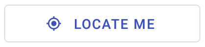

# LocateMeButton

LocateMeButton will find your current location if location permissions are given . If no such permission are given then it will show a dialog with error messege.

## Usage

```jsx
<LocateMeButton onLocationUpdate={()=>void} />
```

## Screenshots

|                              Web                              |                               Android                              |                               IOS                              |
| :-----------------------------------------------------------: | :----------------------------------------------------------------: | :------------------------------------------------------------: |
|  |  |  |

## Component Props

|       Name       |                          Type                          | Default |                       Description                      |
| :--------------: | :----------------------------------------------------: | :-----: | :----------------------------------------------------: |
| onLocationUpdate | (input: { latitude: number; longitude: number })=>void |         | This function will set value of latitude and longitude |

## User Stories

|                 Story                | In Storybook | Has Unit Test |
| :----------------------------------: | :----------: | :-----------: |
|  should fetch location successfully  |       ✅      |       ✅       |
| should show an error dialog on error |       ✅      |       ✅       |
