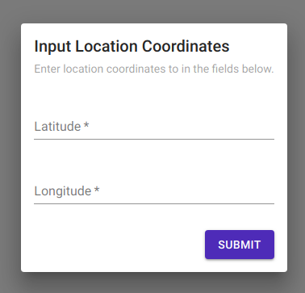

# LocationInputDialog

Shows Input Dialog which takes longitude and latitude value from the user.

## Usage

```jsx
<LocationInputDialog
    visible
    onDismiss={()=>void}
    onSubmit={()=>void}
/>
```

## ScreenShots

|                    🌏 Web                   |                         📱 Android                         |                           📱 iOS                           |
| :-----------------------------------------: | :--------------------------------------------------------: | :--------------------------------------------------------: |
|  |  |  |

## Component Props

|    Name   |                              Type                              | Default |                 Description                 |
| :-------: | :------------------------------------------------------------: | :-----: | :-----------------------------------------: |
|   style   |                           ViewStyles                           |    ️    |   styles which will be applied on coponent  |
|  visible  |                             Boolean                            |    ️    | it is used to make the input dialog visible |
| onDismiss |                            ()=>void                            |    ️    |   function which will be called on Dismiss  |
|  onSubmit | (coordinates: { latitude: number, longitude: number }) => void |    ️    |   function which will be called on submit   |

## User Stories

|                    Story                   | In Storybook | Has Unit Test |
| :----------------------------------------: | :----------: | :-----------: |
| should show a dialog with two input fields |       ✅      |       ✅       |
