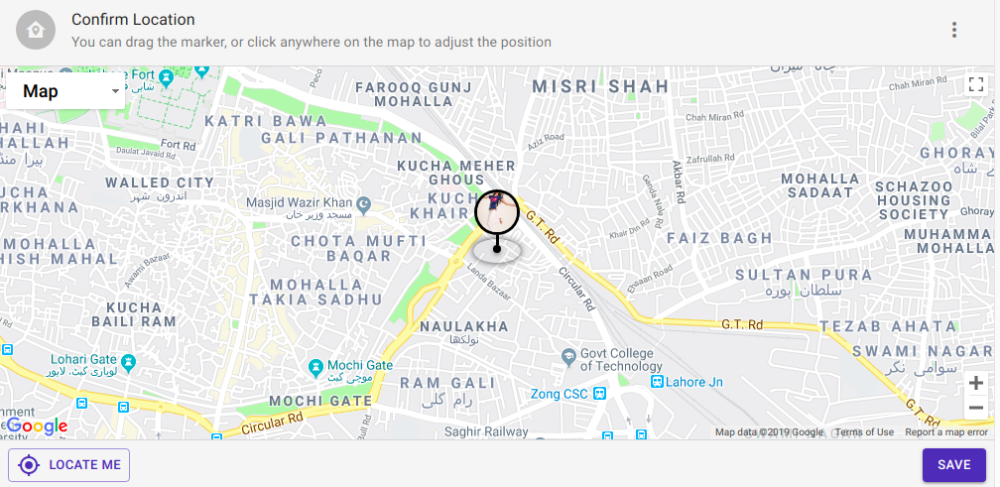
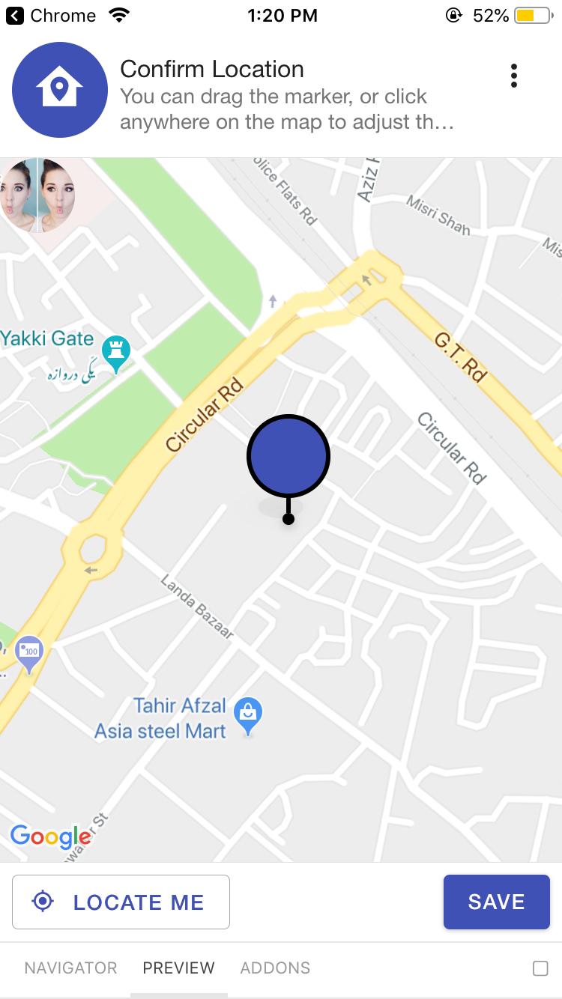

# LocationInputView

In this component we can add our custom location by providing the value of longitude and latitude in the input dialog
which user can open by clicking the menu button.We can also set location by dragging the map.

## Usage

```jsx
<LocationInputView
    latitude={}
    longitude={}
    title={}
    description={}
/>
```

## Screenshots

|                              Web                             |                              Android                             |                                IOS                               |
| :----------------------------------------------------------: | :--------------------------------------------------------------: | :--------------------------------------------------------------: |
|  |  |  |

## Component Props

|     Name    |           Type          | Default |                  Description                  |
| :---------: | :---------------------: | :-----: | :-------------------------------------------: |
|  longitude  |          number         |         |           longitude of the location           |
|  latitiude  |          number         |         |            latitude of the location           |
|    title    |        ReactNode        |         |        it is used to display the title        |
| description |        ReactNode        |         |     it is used to display the description     |
|    styles   | LocationInputViewStyles |         | styles which will be applied on the component |

## Component Styles

|   Name  |    Type   |           Description           |
| :-----: | :-------: | :-----------------------------: |
|   root  | ViewStyle | used to style at the root level |
|   map   | ViewStyle |      used to style the map      |
|  marker | ViewStyle |     used to style the marker    |
|  pulse  | ViewStyle |     used to style the pulse     |
| actions | ViewStyle |  used to style the Card.Actions |

## User Stories

|                                 Story                                | In Storybook | Has Unit Test |
| :------------------------------------------------------------------: | :----------: | :-----------: |
|            should display a map with the given coordinates           |       ✅      |       ✅       |
|          should display a dialog when menu button is pressed         |       ✅      |       ✅       |
| should not throw exceptions even when used directly without BlueBase |       ✅      |       ✅       |
