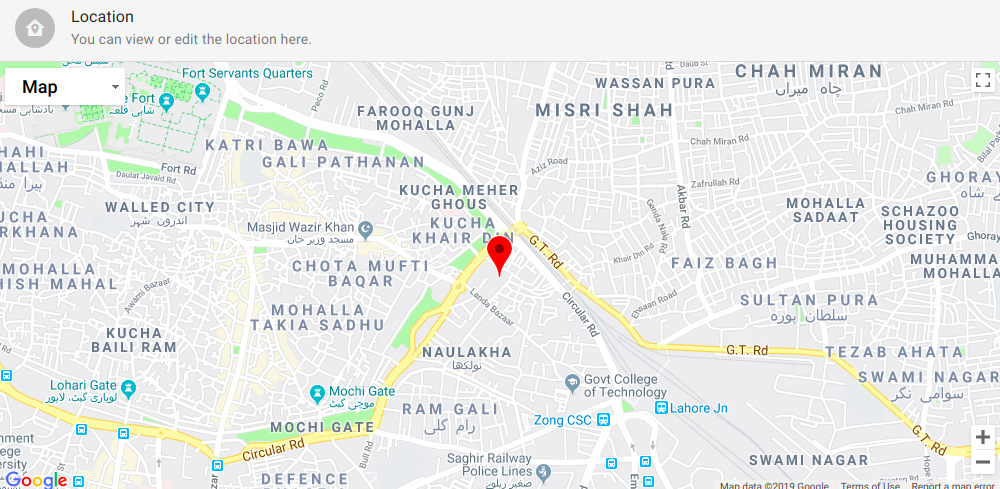
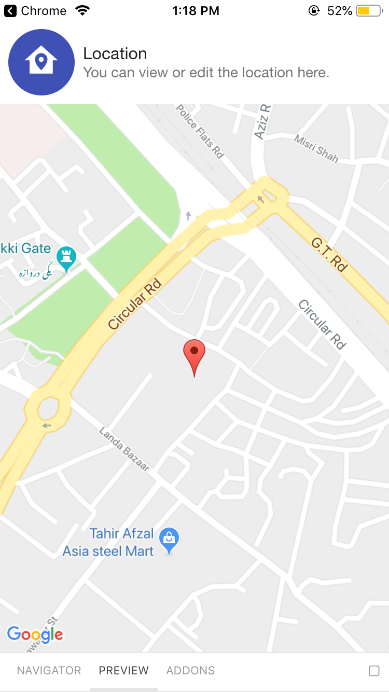

# LocationDisplayView

Shows the View which displays the user location.

## Usage

```jsx
<LocationDisplayView
    latitude={}
    longitude
    title={}
    description={}
    right={}
/>
```

## ScreenShots

|                          🌏 Web                         |                         📱 Android                         |                           📱 iOS                           |
| :-----------------------------------------------------: | :--------------------------------------------------------: | :--------------------------------------------------------: |
|  |  |  |

## Component Props

|     Name    |            Type           | Default |                      Description                      |
| :---------: | :-----------------------: | :-----: | :---------------------------------------------------: |
|   latitude  |           Number          |    ️    |             it is used to provide location            |
|  longitude  |           Number          |    ️    |             it is used to provide location            |
|    title    |      React.ReactNode      |    ️    |            it is used to display the title            |
| description |      React.ReactNode      |    ️    |         it is used to display the description         |
|    right    |      React.ReactNode      |    ️    | it is used to display the ReactNode on the right side |
|    styles   | LocationDisplayViewStyles |    ️    |     styles which will be applied on the component     |

## Component Styles

| Name |    Type   | Default |                Description               |
| :--: | :-------: | :-----: | :--------------------------------------: |
| root | ViewStyle |    ️    | the styles will be applied on root level |
|  map | ViewStyle |         |    styles which will be applied on map   |

## User Stories

|                          Story                          | In Storybook | Has Unit Test |
| :-----------------------------------------------------: | :----------: | :-----------: |
|       should render view with correct coordinates       |       ✅      |       ✅       |
| should not throw any exceptions without BlueBase themes |       ✅      |       ✅       |
