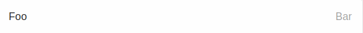

# MetaListItem

A simple list component to display meta data.

## Usage

```jsx
<MetaListItem
    title="Foo"
    description="Bar"
    divider
/>
```

## ScreenShots

|                 🌏 Web                 |                 🖥 Android                 |                      📱 IOS                     |
| :------------------------------------: | :----------------------------------------: | :---------------------------------------------: |
|  |  |  |

## Component Props

|     Name    |         Type         | Default |                    Description                    |
| :---------: | :------------------: | :-----: | :-----------------------------------------------: |
|    title    |        String        |    ️    |         The text that is shown on the left        |
| description |        String        |         |        The text that is shown on the right        |
|   divider   |       boolean ️      |         | If `true`, list will have a divider on the bottom |
|    style    |      ViewStyle ️     |         |                  Component Style                  |
|    styles   | MetaListItemStyles ️ |         |              Component style classes              |

## Component Styles

|     Name    |     Type    |                              Description                              |
| :---------: | :---------: | :-------------------------------------------------------------------: |
|    title    |  ️TextStyle |               These styles are applied on the title text              |
| description | TextStyle ️ |            These styles are applied on the description text           |
|   divider   | ViewStyle ️ | These styles are applied on the root node when divider prop is `true` |
|     root    | ViewStyle ️ |                    These styles are applied on root                   |

## User Stories

|                          Story                          | In Storybook | Has Unit Test |
| :-----------------------------------------------------: | :----------: | :-----------: |
|       it should display a title and a description       |       ✅      |       ✅       |
| it should display a divider when divider prop is `true` |       ✅      |       ❌       |
|      it should use custom styles through style prop     |       ✅      |       ✅       |
|      it should use custom style through style prop      |       ✅      |       ✅       |
