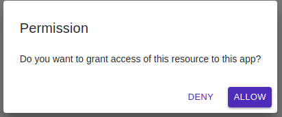
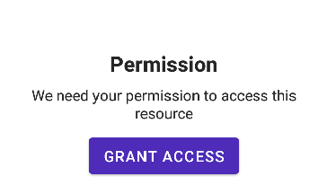
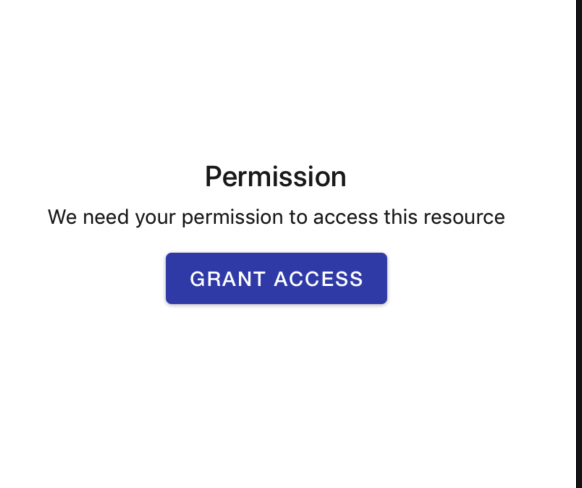

# Permission

Shows a view which gets the Permission from user .

## Usage

```jsx
<Permission> children component to render </Permission>
```

## ScreenShots

|                     🌏 Web                    |                           📱 Android                          |                           📱 iOS                          |
| :-------------------------------------------: | :-----------------------------------------------------------: | :-------------------------------------------------------: |
|  |  |  |

## Component Props

|                    Name                   |                                Type                                | Default |                                      Description                                      |
| :---------------------------------------: | :----------------------------------------------------------------: | :-----: | :-----------------------------------------------------------------------------------: |
|           PermissionAskComponent          | React.ComponentType&lt;{ requestPermission: requestPermissionFn }> |         |          This component is rendered when permission status is "undetermined"          |
|         PermissionDeniedComponent         |                           React.Component                          |         |             This component is rendered when permission status is "denied"             |
|           PermissionDeniedAlert           |                               boolean                              |         |               PermissionDeniedComponent is rendered if this prop is true              |
|         permissionDeniedAlertTitle        |                               string                               |         |             This will be displayed on the permissionDeniedComponent title             |
|      permissionDeniedAlertDescription     |                               string                               |         |          This will be displayed on the permissionDeniedComponent description          |
|   permissionDeniedAlertCancelButtonTitle  |                               string                               |         |        This will be displayed on the cancel button of permissionDeniedComponent       |
| permissionDeniedAlertLearnMoreButtonTitle |                               string                               |         |      This will be displayed on the Learn More button of permissionDeniedComponent     |
|      permissionDeniedAlertOnLearnMore     |                             () => void                             |         | This will be called when he Learn More button of permissionDeniedComponent is pressed |
|                isCompatible               |                     () => Promise&lt;'boolean'>                    |         |                  Checks if the current platform is compatible or not                  |
|            getPermissionStatus            |                  () => Promise<PermissionResponse>                 |         |                             Gets current PermissionStatus                             |
|             requestPermission             |                         requestPermissionFn                        |         |                            Prompt the user for permission.                            |
|          onPermissionStatusChange         |               (response: PermissionResponse) => void               |         |             Show a prompt with permission denied message, instead of view             |
|                promptTitle                |                               string                               |         |                            Title to show on the fake prompt                           |
|             promptDescription             |                               string                               |         |                         Description to show on the fake prompt                        |
|           promptAllowButtonTitle          |                               string                               |         |                          Label of Allow Button on fake prompt                         |
|           promptDenyButtonTitle           |                               string                               |         |                          Label of Deny button on fake prompt                          |
|                  children                 |                  MaybeRenderPropChildren&lt;'any'>                 |         |                    This will be shown if the permission is granted                    |

## User Stories

|                Story               | In Storybook | Has Unit Test |
| :--------------------------------: | :----------: | :-----------: |
| Permission Undetermined => Granted |       ✅      |       ✅       |
|  Permission Undetermined => Denied |       ✅      |       ✅       |
|         Permission Granted         |       ✅      |       ✅       |
|          Permission Denied         |       ✅      |       ✅       |
|     Permission Denied (Prompt)     |       ✅      |       ✅       |
