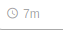

# RelativeTime

Formats a date/timestamp to:

-   just now
-   5m
-   15 min
-   25 minutes
-   an hour ago
-   1 mo.
-   5 years ago
-   … or whatever else

## Screenshots

|                     Web                     |                    Android                   |                      IOS                     |
| :-----------------------------------------: | :------------------------------------------: | :------------------------------------------: |
|  |  |  |

Icon is not part of the component

## Component Props

|    Name   |         Type        | Default |           Description           |
| :-------: | :-----------------: | :-----: | :-----------------------------: |
|    time   |   string \| number  |         |             the time            |
| component | React.ComponentType |         | react component to display time |

## User Stories

|                  Story                  | In Storybook | Has Unit Test |
| :-------------------------------------: | :----------: | :-----------: |
|    should accept time in milliseconds   |       ✅      |       ✅       |
|     should accept time as undefined     |       ❌      |       ✅       |
|      should accept time as a string     |       ✅      |       ✅       |
|     should render when time changes     |       ✅      |       ✅       |
| should give error when no time is given |       ✅      |       ❌       |

## Questions

|                      RelativeTime                     |               Answers              |
| :---------------------------------------------------: | :--------------------------------: |
| Whats the time if user had not logged in for 23 hours |                 23h                |
|   Whats the time if user had not logged in for a day  | Last online Date will be displayed |
|  Whats the time if user had not logged in for a month | Last online Date will be displayed |
