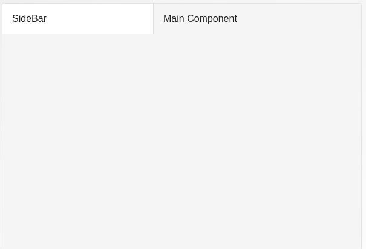
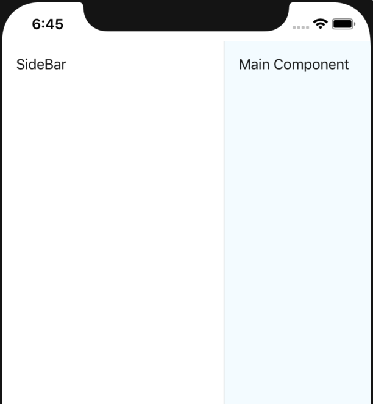
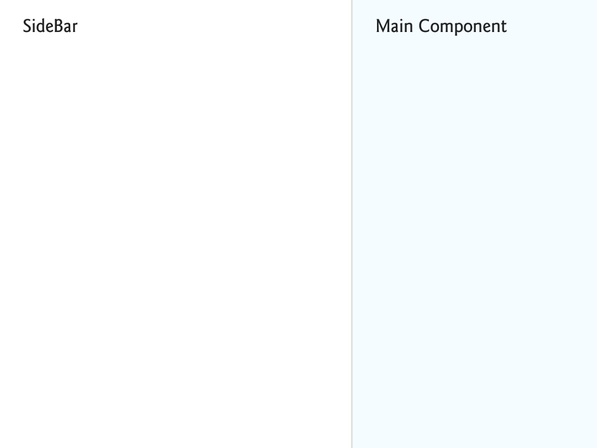

# SideBar Layout

A component which contains a sidebar content which renders on screen's left and a main component.

## Usage

```jsx
<SidebarLayout MainContentComponent={() => (<Text>Main</Text>)} SidebarContentComponent={() => (<Text>SideBar</Text>)} />
```

## ScreenShots

|                   Web                  |                     IOS                    |                     Android                    |
| :------------------------------------: | :----------------------------------------: | :--------------------------------------------: |
|  |  |  |

## Component Props

|           Name          |       Type      | Default |                                                                                 Description                                                                                 |
| :---------------------: | :-------------: | :-----: | :-------------------------------------------------------------------------------------------------------------------------------------------------------------------------: |
| SidebarContentComponent | React component |         |                                                                        component to render at sidebar                                                                       |
|   MainContentComponent  | React Component |         |                                                                         Component to render as main                                                                         |
|          styles         |   Style Object  |         | `root` for root view styles, `sidebar` for sidebar styles and `sidebarContent` for sidebar content styles, `main` for main styles and `mainContent` for main content styles |

## User Stories

|                    Story                   | In Storybook | Has Unit Test |
| :----------------------------------------: | :----------: | :-----------: |
|                Basic Example               |       ✅      |       ✅       |
| should render sidebar content successfully |       ❌      |       ✅       |
|   should render main content successfully  |       ❌      |       ✅       |
