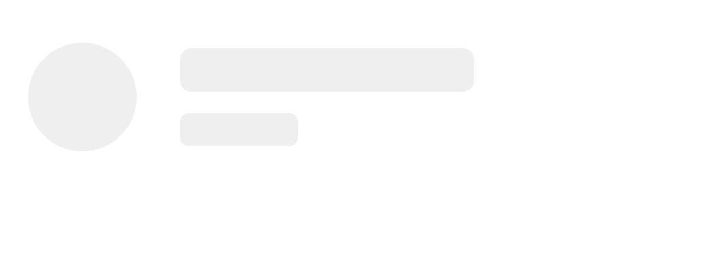

# SkeletonListItem

SkeletonListItem is used to show loading state of a List.

## Usage

```jsx
<SkeletonListItem avatar={true} description={true} />
```

## Screenshots

|                                    Web                                    |                                     IOS                                    |                                     Android                                    |
| :-----------------------------------------------------------------------: | :------------------------------------------------------------------------: | :----------------------------------------------------------------------------: |
|  |  |  |

## Component Props

|     Name    |                Type               | Default |                         Description                         |
| :---------: | :-------------------------------: | :-----: | :---------------------------------------------------------: |
| description |              boolean              |  false  |       Check SkeletonListItem will have Avatar skeleton      |
|    avatar   |              boolean              |  false  |    Check SkeletonListItem will have description skeleton    |
|   variant   |               string              |  circle | Check SkeletonListItem will have avatar skeleton as variant |
|    styles   | Partial\\<SkeletonListItemStyles> |         |    These are used to set default styles of skeleton List    |
|    style    |       StyleProp\\<ViewStyle>      |         |                Style prop of SkeletonListItem               |

## Component Style

|          Name         |     Type    |                            Description                            |
| :-------------------: | :---------: | :---------------------------------------------------------------: |
|          root         |  ViewStyle  | These styles are applied on description,title and avatar skeleton |
|      description      | ViewStyle ️ |      These styles are applied on description of skeleton list     |
|         media         | ViewStyle ️ |      These styles are applied on size of description skeleton     |
|        itemBox        |  ViewStyle  |   These styles are applied for description and title of skeleton  |
|    titleLineHeight    |    number   |                                                                   |
| descriptionLineHeight |    number   |                                                                   |

## User Stories

|                       Story                      | In Storybook | Has Unit Test |
| :----------------------------------------------: | :----------: | :-----------: |
|       PlaceCard Skeleton with default props      |       ✅      |       ✅       |
|    PlaceCard Skeleton with default avatar prop   |       ✅      |       ✅       |
| PlaceCard Skeleton with default description prop |       ✅      |       ✅       |
|         PlaceCard Skeleton with all props        |       ✅      |       ✅       |
