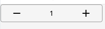

# Stepper

Display a Stepper, a sequence of logical and numbered steps

## Usage

Basic Example

```jsx
<Stepper value={1} onChangeValue={onChangeValue} />
```

## ScreenShots

|                   Web                  |                     IOS                    |                     Android                    |
| :------------------------------------: | :----------------------------------------: | :--------------------------------------------: |
|  |  |  |

## Component Props

|      Name     |       Type       |     Default     |          Description          | Required                                 |   |
| :-----------: | :--------------: | :-------------: | :---------------------------: | ---------------------------------------- | - |
|    disabled   |      boolean     |      false      | Toggles stepper counter state | ❌                                        |   |
|      min      |      number      |        0        |     Minimum stepper value     | ❌                                        |   |
|      max      |      number      |       9999      |     Maximum stepper value     | ❌                                        |   |
|      step     |      number      |        1        |     Stepper interval value    | ❌                                        |   |
|     value     |      number      |                 |   Value displayed on counter  | ✅                                        |   |
| onChangeValue | \`(value: number | null) => void\` |                               | Function triggered when value is changed | ❌ |
|     error     |      boolean     |      false      |      Toggles error state      | ❌                                        |   |
|   helperText  |      string      |                 |    Displays any helper text   | ❌                                        |   |

## User Stories

|                     Story                     | In Storybook | Has Unit Test |
| :-------------------------------------------: | :----------: | :-----------: |
|                 Basic Example                 |       ✅      |       ✅       |
|             With max, min and step            |       ✅      |       ✅       |
|                value 16, max 8                |       ✅      |       ✅       |
|                  error state                  |       ✅      |       ✅       |
|                 disabled state                |       ✅      |       ✅       |
| should update value when a new prop is passed |       ✅      |       ✅       |

```

```
