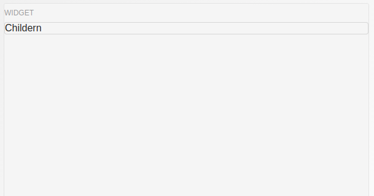

# Widget

A component which contains a title and content or children that renders below title.

## Usage

```jsx
<Widget title="Widget" content={() => (<Text>Widget</Text>)} />
```

## ScreenShots

|                   Web                  |                     IOS                    |                     Android                    |
| :------------------------------------: | :----------------------------------------: | :--------------------------------------------: |
|  |  |  |

## Component Props

|   Name  |            Type           | Default |                                       Description                                      |
| :-----: | :-----------------------: | :-----: | :------------------------------------------------------------------------------------: |
|  title  | string or React component |   none  |                                      Widget Title                                      |
| content |      React Component      |   none  |                             Component to render below title                            |
|  styles |        Style Object       |         | `root` for root view styles, `title` for title styles and `content` for content styles |
|         |           string          |         |                                       Form Title                                       |

## User Stories

|                  Story                  | In Storybook | Has Unit Test |
| :-------------------------------------: | :----------: | :-----------: |
| Rendering content if content prop given |       ✅      |       ✅       |
|    Rendering child if childern given    |       ✅      |       ✅       |
|         widget with some styles         |       ✅      |       ❌       |
