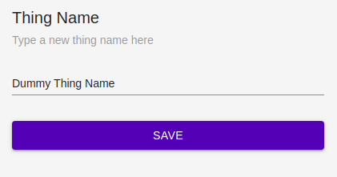
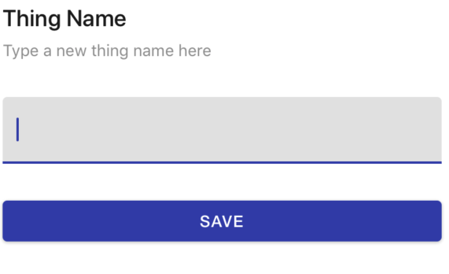
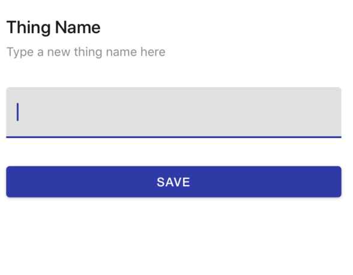

# ThingNameForm

In thing setting it will display a form to update thing's name.

## Usage

```jsx
<ThingNameForm id={01} onSuccess={()=>{}} />
```

## ScreenShots

|                            🌏 Web                           |                           📱 Android                           |                           📱 iOS                           |
| :---------------------------------------------------------: | :------------------------------------------------------------: | :--------------------------------------------------------: |
|  |  |  |

## Component Props

|    Name   |  Type  | Default |             Description             |
| :-------: | :----: | :-----: | :---------------------------------: |
|     id    | Number |         | id for which thing's name will show |
| onSuccess | ()=>{} |         |   called on successful name change  |

## User Stories

|                     Story                    | In Storybook | Has Unit Test |
| :------------------------------------------: | :----------: | :-----------: |
| should render ThingNameForm without crashing |       ✅      |       ✅       |
|          should render ThingNameForm         |       ✅      |       ✅       |
