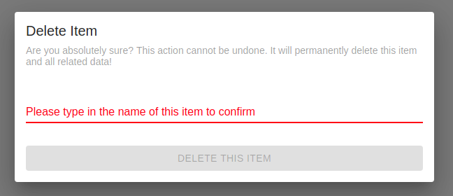
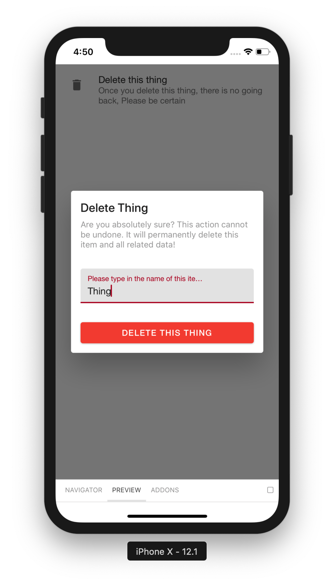
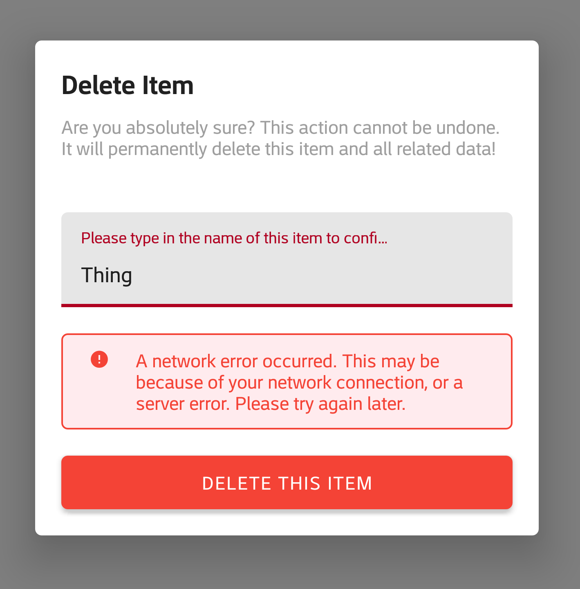

# DeleteSetting

A component which delete thing.

## Usage

```jsx
<DeleteSetting />
```

## ScreenShots

|                   Web                  |                     IOS                    |                     Android                    |
| :------------------------------------: | :----------------------------------------: | :--------------------------------------------: |
|  |  |  |

## User Stories

|          Story         | In Storybook | Has Unit Test |
| :--------------------: | :----------: | :-----------: |
|      Basic Example     |       ✅      |       ✅       |
| Error in getting thing |       ✅      |       ✅       |
|  Error in delete thing |       ✅      |       ✅       |
|    No thingId found    |       ❌      |       ✅       |
